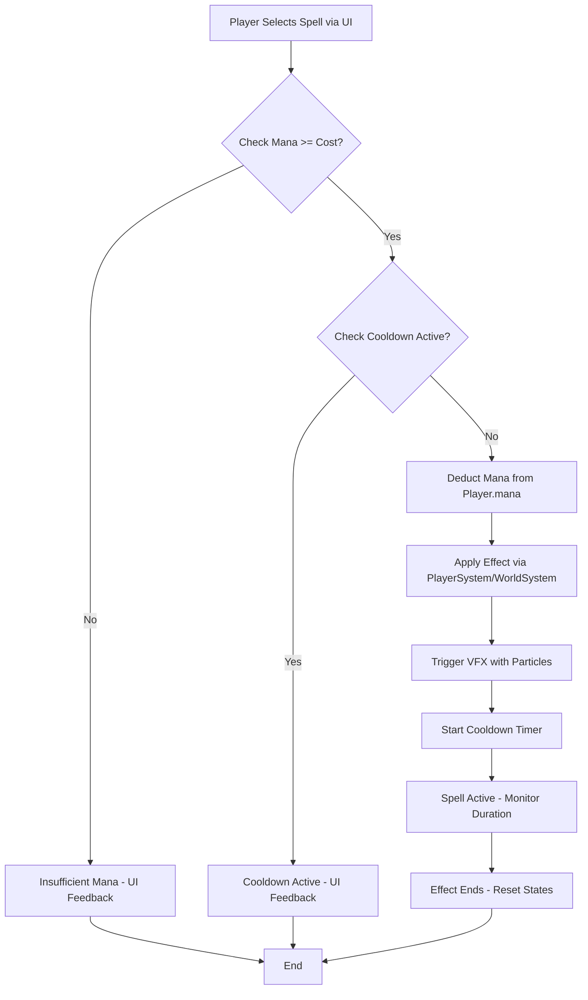

# Spell System Design for Magical Carpet

## Overview

The Spell System enhances the serene, magical exploration theme of Magical Carpet by providing non-combat spells that aid in mana collection, navigation, and world interaction. Spells consume collected mana, giving purpose to exploration, and integrate with existing systems like PlayerSystem for casting and WorldSystem for effects (e.g., terrain queries). Spells unlock progressively through mana thresholds or landmark visits, tying into the core loop: explore → collect mana → cast spells to explore further → progress quests.

Spells are defined in a extensible JSON data structure, loaded at runtime for easy modding. Casting flow: Player selects spell via UI, checks mana/cooldown, deducts mana, applies effect, triggers VFX, starts cooldown.

## Spell Designs

Here are 4 exploration-focused spells:

1. **Wind Glide**  
   - **Description**: Harness gentle winds to boost carpet speed, allowing faster traversal of vast terrains.  
   - **Mana Cost**: 10  
   - **Cooldown**: 30 seconds  
   - **Effect**: Increases max speed by 50% for 10 seconds. Integrates with PlayerSystem.physics for velocity scaling; no WorldSystem interaction.  
   - **Unlocking**: Reach 100 total mana collected or visit first landmark (via LandmarkSystem).  
   - **VFX**: Swirling wind particles around carpet using existing [particles.png](public/assets/textures/particles.png); blue ethereal trails.

2. **Aether Shield**  
   - **Description**: Summon a protective magical barrier to shield against environmental hazards like turbulent winds or low-altitude scrapes.  
   - **Mana Cost**: 15  
   - **Cooldown**: 60 seconds  
   - **Effect**: Grants invulnerability and stabilizes altitude for 5 seconds. Integrates with PlayerSystem.health and physics to ignore collisions/damage.  
   - **Unlocking**: Accumulate 200 mana or visit second landmark.  
   - **VFX**: Glowing spherical shield with particle sparks from [particles.png](public/assets/textures/particles.png); golden hue with fading opacity.

3. **Mana Reveal**  
   - **Description**: Scan the surroundings to reveal hidden mana nodes and nearby landmarks on the minimap.  
   - **Mana Cost**: 5  
   - **Cooldown**: 45 seconds  
   - **Effect**: Queries WorldSystem for mana nodes/landmarks within 500 units radius, updates MinimapSystem. Lasts 10 seconds with highlighted overlays.  
   - **Unlocking**: Visit 3 landmarks (tracked by LandmarkSystem).  
   - **VFX**: Pulsing radial scan wave using particle bursts from [particles.png](public/assets/textures/particles.png); green mystical glow.

4. **Essence Surge**  
   - **Description**: Infuse the carpet with magical essence to temporarily double mana collection from nodes.  
   - **Mana Cost**: 20  
   - **Cooldown**: 120 seconds  
   - **Effect**: Multiplies mana gain x2 for 20 seconds. Integrates with PlayerSystem.mana on collection events from WorldSystem.manaNodes.  
   - **Unlocking**: Reach 500 total mana.  
   - **VFX**: Aura of sparkling particles enveloping the carpet from [particles.png](public/assets/textures/particles.png); purple shimmering effect.

## JSON Schema for Spell Data

Spells are stored in a JSON array for extensibility. Example structure:

```json
{
  "type": "array",
  "items": {
    "type": "object",
    "properties": {
      "name": { "type": "string" },
      "description": { "type": "string" },
      "manaCost": { "type": "number", "minimum": 0 },
      "cooldown": { "type": "number", "minimum": 0 },
      "effect": {
        "type": "object",
        "properties": {
          "type": { "type": "string", "enum": ["speedBoost", "shield", "scan", "surge"] },
          "duration": { "type": "number" },
          "magnitude": { "type": "number" },
          "radius": { "type": "number" }
        }
      },
      "unlockCondition": { "type": "string", "enum": ["manaThreshold", "landmarkVisit"] },
      "unlockValue": { "type": "number" },
      "vfx": {
        "type": "object",
        "properties": {
          "particleTexture": { "type": "string" },
          "color": { "type": "string" },
          "scale": { "type": "number" }
        }
      },
      "integration": {
        "type": "array",
        "items": { "type": "string" }
      }
    },
    "required": ["name", "description", "manaCost", "cooldown", "effect", "unlockCondition"]
  }
}
```

This schema allows loading from `assets/spells.json` in AssetManager, parsed into PlayerSpells.spellTypes. Extensible for new effects without code changes.

## Casting Flow Diagram

Mermaid flowchart for spell casting process:



## VFX Specifications

All VFX use the existing particle system texture [particles.png](public/assets/textures/particles.png) for performance. Integrate via PlayerSpells.createEffect() method, similar to existing muzzle flash/impact effects but adapted for exploration:

- **Particle Setup**: Use THREE.PointsMaterial with texture, emissive colors matching spell theme (e.g., blue for Wind Glide).
- **Animation**: Emit 10-20 particles with random velocities, fade over duration using opacity/life cycles as in current PlayerSpells.updateSpells().
- **Integration**: Attach to player.model for auras/shields; world-space for scans. Reuse audio/spell.mp3 for casting sound.
- **Performance**: Limit to 50 active particles total, cull beyond 1000 units from player.

No new assets needed; repurpose existing glTF models if required (e.g., mana.glb for surge visuals).

## Integration into Core Loop

Spells create a rewarding loop: 
- **Exploration & Collection**: Players fly over terrain (WorldSystem) to collect mana nodes, building mana reserves.
- **Spending Mana**: Cast spells to overcome exploration challenges (e.g., Mana Reveal to find more nodes faster, Wind Glide for quicker travel).
- **Progression**: Unlocking via mana thresholds/landmarks advances quests (e.g., "Discover 5 landmarks" requires spells for efficiency). This encourages repeated exploration without combat, maintaining serenity.
- **Quest Tie-in**: Quests like "Gather 1000 mana" or "Visit ancient sites" are gated by spell unlocks, using LandmarkSystem to track progress.
- **Balance**: High costs/cooldowns prevent spam; mana regen via passive exploration keeps flow engaging.

This design refactors existing combat-oriented PlayerSpells.js toward exploration, removing damage mechanics and adding mana/effect logic.